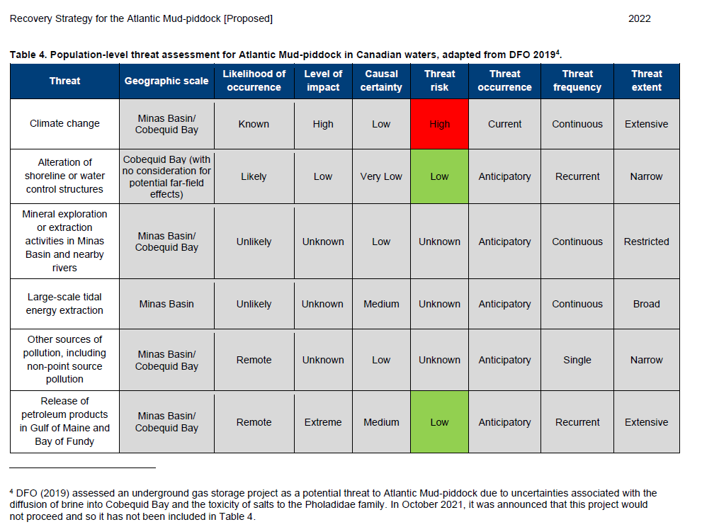
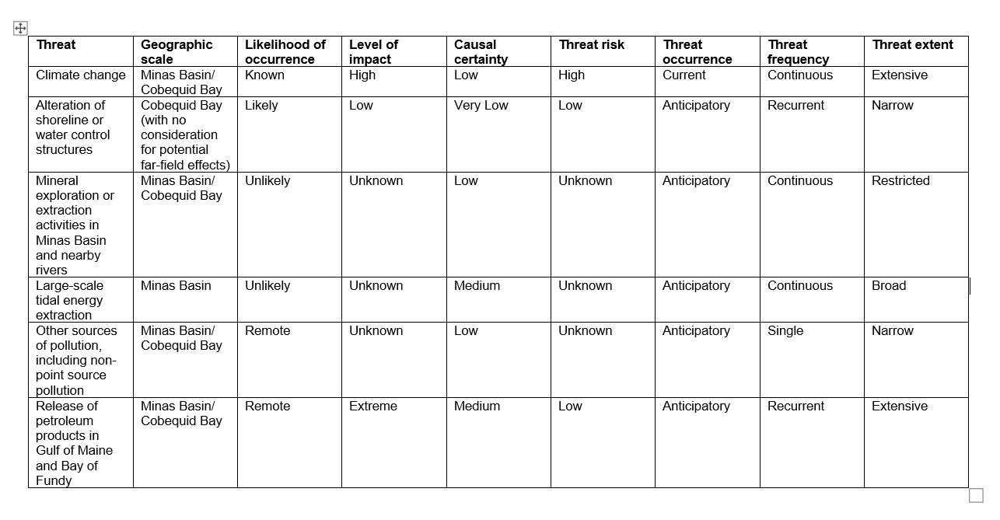
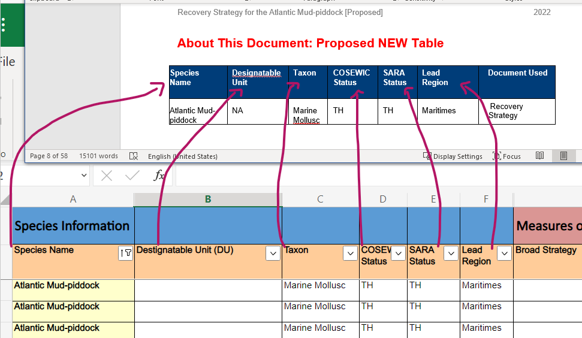

```{r setup, include=FALSE}
knitr::opts_chunk$set(echo = TRUE)
library(DiagrammeR)

library(reticulate)
use_python("../venv/Scripts")

```

## Project Conceptual Diagram 

This document summarizes a collection of solutions for extracting recovery measures information from Recovery Documents using Reproducible Analytical Pipelines. Findings will help identify best practices for future data entry and reporting. Outcomes of this project will include: 

- Testing and evaluating the use of Reproducible Analytical Pipelines to automate data extraction from SARA recovery documents and Species at Risk geodatabase.  

- Make recommendations regarding document elements (e.g. formatting or codes) required to identify and extract relevant information into a spreadsheet. This will coincide with the Species at Risk Program recovery and implementation team plans to revise Species’ Progress Report templates and other recovery document templates this fiscal year. 

- Conceptual workflow of elements that would be required to reverse-engineer outcomes 1 and 2 (above) by using forms, csv files, or Excel spreadsheets to generate reproducible reports (e.g. using Microsoft PowerBI, R Markdown, or other tools that are easily used and accessible to Species at Risk Program staff). 

For more information about this project, please see the [project proposal.](https://086gc.sharepoint.com/:w:/s/MaritimesSpatialPlanning-MAROpenDataLogistics/EZLu-2jTNt1DgVY_0GsX3eEBtsJwi7xA_vWNSAqwBURbdg) 

```{r workflow, include=FALSE}
knitr::opts_chunk$set(echo = TRUE)
workflow <- DiagrammeR::grViz("digraph {
  graph [layout = dot, rankdir = TB]
  
  node [shape = rectangle]        
  rec1 [label = 'Step 1. Recovery Document Table [PDF, Word, or...]']
  rec2 [label = 'Step 2. Data Frame']
  rec3 [label = 'Step 3. Data Frame to csv, excel or...']
  rec4 [label = 'Step 4. Reporting [interactive reporting web-based and customized static reporting]']
  
  rec1 -> rec2 -> rec3 -> rec4
  }",
  height = 500)
```

```{r workflow plot}
workflow
```

## Exploration of options for Step 1 to Step 2: Examples below display outcomes for Table 4 of Mud-Piddock Recovery Assessment.

```{r workflow2, include=FALSE}
knitr::opts_chunk$set(echo = TRUE)
Option1 <- DiagrammeR::grViz("digraph {
  graph [layout = dot, rankdir = TB]
  
  node [shape = rectangle]        
  rec1 [label = 'Table in PDF/Word of selected Recovery Documents']
  rec2 [label = 'Tool e.g. R, Python, and others']
  rec3 [label = 'Table Extraction']
  rec4 [label = 'Data Frame']

  rec1 -> rec2 -> rec3 -> rec4 
  }",
  height = 500)
```
Exploring solutions if tables in PDFs are the preferred way to store information
```{r workflow plot2}
Option1
```

Examples below display outcomes for Table 4 of Mud-Piddock Recovery Assessment. 




### `tabulizer` R Package

Package ‘tabulizer’ was removed from the CRAN repository thus installation was conducted directly from GitHub. This leaves us at the mercy of package developers that could discontinue its mantainance. More here: https://github.com/ropensci/tabulizer 

```{r}
#remotes::install_github(c("ropensci/tabulizerjars", "ropensci/tabulizer"), INSTALL_opts = "--no-multiarch")
```


```{r}
library(remotes)
library(rJava)
library(tabulizer)
tabletest <- "Rs-PholadeTronqueeAtlMudPiddock-v00-2022Aug-Eng.pdf"
#fullextraction <- extract_tables(tabletest) # You may uncomment this line if you would like to extract tables form the whole document.
table4 <- extract_tables(tabletest, pages = 20)
table4
```

The output is a bit convoluted with a series of empty spaces and disjointed/unconnected text. Thus next step is to turn the table extraction into a data frame to get an output that resembles the original table a tiny bit more, yet issues prevailed and a bit more tweaking is required (coding side and/or way tables are designed = the simpler the table, the easier for the code to extract it).  

```{r}
table4df <- extract_tables(tabletest, pages = 20, output = "data.frame") %>% as.data.frame()
table4df
```

The solution below still requires a bit more development but the simple extraction seems similar to the original table 4. 

```{r}
library(kableExtra)
table4df %>% kbl(caption = "Table 4") %>%
         kable_classic(full_width = F, html_font = "Cambria") 
```

*Demos*:

- https://github.com/ropensci/tabulizer
- Tabulizer Package: https://www.youtube.com/watch?v=nlsWjezvsg8
- PDF Scrape and exploratory analysis code demo: https://www.business-science.io/code-tools/2019/09/23/tabulizer-pdf-scraping.html#workflow

### `docxtractr` R Package

PDFs seem to have some tricky issues consistently observed while trying different solutions. What about Word Files? We saved Table 4 as a separate Word file and tested `docxtractr` R Package. 



The solution below still requires a bit more development but the simple extraction seems similar to the original table 4. Keeping tables as simple as possible in the word or PDF file is one of the main pieces to implement moving forward. 

```{r}
library(docxtractr)
tabletestdocx <-  read_docx("table4.docx")
docx_tbl_count(tabletestdocx)
tbls <- docx_extract_all_tbls(tabletestdocx)
tbls
```

```{r}
library(kableExtra)
tbls %>% kbl(caption = "Table 4") %>%
         kable_classic(full_width = F, html_font = "Cambria") 
```

### `Camelot` Python Package
Camelot is a python package, installable from Pip ([instructions here](https://camelot-py.readthedocs.io/en/master/user/install.html)) that can extract tables from a PDF based on the lines between cells (Lattice).  This helps improve the quality of the parsed data.

```{python camelot_example}
from camelot import read_pdf

doc_file_path = "Rs-PholadeTronqueeAtlMudPiddock-v00-2022Aug-Eng.pdf"
df_list = read_pdf(doc_file_path, pages="20", line_scale=50)
# this is a list, because there might be more than one table on the page
# print everything:
print(df_list[0].df.to_string())
```
<<<<<<< HEAD
There are a couple potential issues with this method.  Special characters are explicitly recorded (newlines are saved as \n) and items such as graphs can be mistaken as tables.
=======
There are a couple potential issues with this method.  Special characters are explitly recorded (newlines are saved as \\n) and items such as graphs can be mistaken as tables.
>>>>>>> 62035c24090e9449b6e7ce5e07767046ad6d05e2


### `Docx` Python Package
Docx is a python package, installable from Pip (`pip install python-docx`) that can extract tables from word documents.

```{python docx_example}
from docx import Document
recovery_docx = Document("Rs-PholadeTronqueeAtlMudPiddock-v00-2022Aug-Eng.docx")
# recovery_docx.tables is a list containing all of the tables in the docx, print the 3rd one:
for col in recovery_docx.tables[3].columns:
    for cell in col.cells:
        print(cell.text)

```
This method produces a very reliable output that is fairly easy to work with.


### Tabula

- Tabula is free and open source. Tabula was created by journalists for journalists and anyone else working with data locked away in PDFs. https://tabula.technology/  
Software can be used to extract data manually, or folks can implement a solution programatically using python.

*Demos*: 

- https://www.youtube.com/watch?v=702lkQbZx50
- https://www.youtube.com/watch?v=NvcTIZ2Je50 


### Azure Form Recognizer

[Azure Form Recognizer](https://docs.microsoft.com/en-us/azure/applied-ai-services/form-recognizer/overview?WT.mc_id=aiml-14201-cassieb&tabs=v3-0) is a cloud-based Azure Applied AI Service that analyzes forms and documents, extracts text and data, and maps field relationships as key-value pairs: https://formrecognizer.appliedai.azure.com/studio

Azure Form Recognizer could potentially allow coordination with tools withing our Microsoft Suite. It is powered by Python. 

Azure Form Recognizer does not seem to exist in our current suite of tools but we logged in a ticket with IT. It does not seem to be an open source solution (0-500 pages are free per month, after that, there is a cost associated with using this tool https://azure.microsoft.com/en-ca/pricing/details/form-recognizer/)

We have not tested this option yet as there seems to be a price tag associated with number of pages depending on the capacity of data mining. 

*Demos*:

  - https://www.youtube.com/watch?v=rkJa6vbkMcU
  - https://github.com/Azure-Samples/cognitive-services-quickstart-code/blob/master/python/FormRecognizer/rest/python-train-extract.md


## Exploration of options for Step 1 to Step 2: Examples below display outcomes for full Mud-Piddock Recovery Assessment Word document

Mining tables from Word files proved to be the most effective solution using the least amount of coding and manipulation. We therefore proceeded to test the full Recovery Assessment document for Mud-Piddock, using the most promising solutions.  

```{r}
DiagrammeR::grViz("digraph {
  graph [layout = dot, rankdir = TB]
  
  node [shape = rectangle]        
  rec1 [label = 'PDF Recovery Documents']
  rec2 [label = 'Create Word Recovery Document using Foxit']
  rec3 [label = 'Identify key terms of tables to be extracted in the Word document']
  rec4 [label = 'Extract relevant tables programatatically']

  rec1 -> rec2 -> rec3 -> rec4 
  }",
  height = 500)
```

### `docxtractr` R Package

```{r}
library(docxtractr)
testdocx <-  read_docx("Rs-PholadeTronqueeAtlMudPiddock-v00-2022Aug-Eng.docx")
docx_tbl_count(testdocx)
alltables <- docx_extract_all_tbls(testdocx)
str(alltables)
```

```{r}
library(kableExtra)
alltables[[1]] %>% kbl(caption = "Testing Full Extraction of Tables") %>%
         kable_classic(full_width = F, html_font = "Cambria") 
```

Word files seem to be providing a really nice output. Our next task now is to identify which tables specifically will be mined. For this, we manually compared the [spreadsheet information](https://086gc.sharepoint.com/:x:/s/NatureLegacyDatabase/ETYmtFpJ9AZOvNfXyHrAPTABOdFZi_XDRDUuZaIqSHo8tA) shared by the SARA Program and the source document/word file used for this test (Atlantic Mud-piddock). 

Column Name in Word Doc Table    | Column Name in Spreadsheet
-------------                    | -------------       
Species                          | Species Name         
Threat                           | Not included         
Geographic scale                 | Not included      
Likelihood of occurrence         | Not included      
Level of impact                  | Not included      
Causal certainty                 | Not included
Threat risk                      | Not included
Threat occurrence                | Not included
Threat frequency                 | Not included
Threat extent                    | Not included
General description of research and management approaches | Recovery Measures/ Conservation Measures  
Priority                         | Not included
Broad strategy                   | Not included
Threat or concern addressed      | Not included


Column Name in Spreadsheet       | Column Name in Word Doc Table 
-------------                    | -------------       
Designatable Unit (DU)           | Not included         
Taxon	                           | Not included      
COSEWIC Status                	 | Not included      
SARA Status	                     | Not included 
Lead Region                      | Not included 
Broad Strategy                   | Not included 
Document Used	                   | Not included 
Document Reference               | Not included 


Column name in Spreadsheet Tab Recovery Measure  | Column name in Spreadsheet Tab Recovery Measure Tracking
-------------                                    | -------------       
Recovery Measures/ Conservation Measures         | AP: Recovery Measures

We tested the process of adding a potential new table in the Recovery Documents/Action Plans that could be added in future word files with information that could be mined into an authoritative spreadsheet. 



We also modified and standardized names of the additional columns to be mined from the word documents into the spreadsheets. These are tentative names until SARA Program decides which names could be used systematically in all future documents in the future. This will make the process of minig tables significantly simpler as the codes will be looking for this unique names within tables. For this test, we did the following changes in the two word documents: 

- The symbol "#" to indicate the number of the Recovery Measure was replaced with "Measure ID" [code does not like "#", right?]. 
- "General description of research and management approaches" in mud-piddock and "Recovery measures" in Blue Whale was replaced with the column name "Detailed Measures"
- "Measure ID" and "Detailed Measures" were combined in the blue whale document; we separated them into two columns for the blue whale document to match the requirements in the spreadsheet and the mud-piddock document.
- Values in the "Broad strategy" column were replaced with text instead of code numbers, to match the blue whale recovery document and to make the process of mining info as simple as possible e.g. "1" was replaced with "Research and monitoring"
 
The above mentioned changes have led to the following key words to be used to mine the two test recover documents:

- Measure ID
- Detailed Measures
- Broad strategy
- Species Name
- Designatable Unit	
- Taxon	
- COSEWIC Status
- SARA Status	
- Lead Region	
- Document Used

Note: solution should not be case sensitive. 

Created or edited tables/column nam,es in two test word files for blue whale and mud-piddock to make the process of mining info more simple.


## Agenda Meeting 2

### User stories

DFO staff is tasked with mining tables from Recovery Documents PDF/Word files to organized them in a nice and clean spreadsheet for future reporting. Below are potential future scenarios of what their experience could be using different approaches.
  
####  Scenario 1: Staff mines tables directly from current Recovery Document PDF/Word files

Staff mine tables that have weird double lines, non matching lines and background white lines separating the cells. Significant amount of extra coding and tweaking is required for each table is a customized fashion. This scenario is a bit cumbersome and requires extra manipulation.    

#### Scenario 2: Staff mines tables directly from improved Recovery Document Word files. 

Staff mine tables directly from Word files provided by the authors, or generated from the authoritative PDFs using software like Foxit. Staff mine tables easily because authors rigorously applied the following recommendations for each table:

- Tables rows do not break from page to page
- Columns names are unique, short, succinct, and fully standardized in *all* recovery documents  
- Unique column names are KEY because code will be looking for those in the tables extracted 
- Do not use numbers/codes in the values of tables. Please use text to make the mining process as simple as possible.e.g. instead of using "1" for Broad strategy, use the direct wording "Research and monitoring"

#### Scenario 3: Staff mines tables directly from Recovery Document Word files that include additional metadata. 

Improved Word documents follow explicit guidance to create tables have metadata (a.k.a. tables) that is mined at the same time as the filepath when scraping the doc.

#### Scenario 4: Staff takes advantage of a new workflow to store and mine the data using a GUI

Mining PDF and Word files is a possibility. However, is there a better approach for mining data and storing it in an authoritative place. Data could then be mined from something different than a PDF/Word file... something such as database, excel sheets, GUI, which could be populated as part of a submission. 

The evaluation of any scenario must take into account the time and user experience of i) folks writing/publishing SARA documents, ii) folks mining these documents.

Interesting fact: One of our members of our team did the manual extraction/mining of the same threat tables of the same recovery documents. Solutions for the future must include to communicate this type of efforts to support each other and share information.
     
### Recommendations for input spreadsheet 

Need a bit of cleaning before interactive report pilot - happy to do cleaning with recommendations on how to keep spreadsheets as clean as possible for coding (Excel spreadsheets, CSV, Databases)


## Flags & Questions TBD 

  - Are PDFs or Word Files the best way to store metadata (a.k.a) tables from Recovery Documents?
    - maybe? if very specific conditions are applied for every future publication. This could increase time folks spend formatting. 
    - If not, why not, and what solutions can we offer? Instead of spending time formatting, is there a betetr solution for management of this type of data? This involves:
         - Folks writing SARA documents: would they be interested in reporting key tables in the PDF as well as an additional database?
         - Folks mining these documents: what is their background? a solution involving programming may require a coding background?
- When mining tables in the future from the Recovery Document PDF/Word file:
   - Do you envision mining tables directly from the Recovery Document PDF/Word file directly? We could slect one of the options presented in this document to explore further.
   - Or are you open to recommendations in the workflow to store and mine the data from somewhere else (e.g. database, excel sheets populated as part of submission)?
